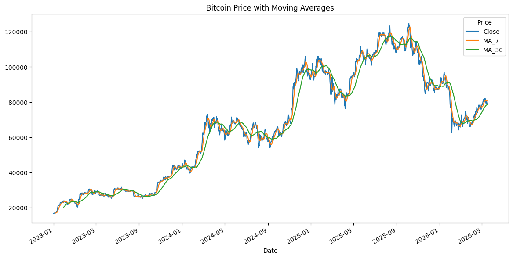
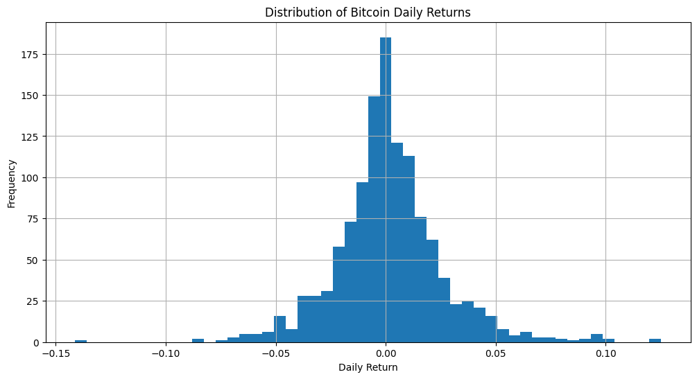
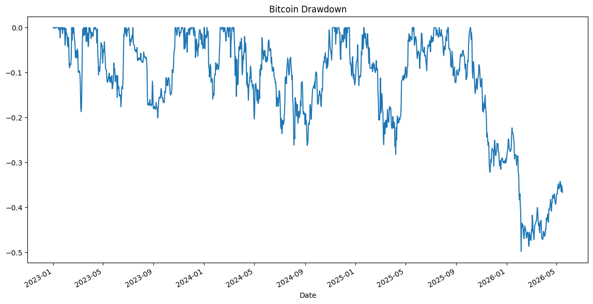

# Bitcoin Market Analysis with Python

This project explores Bitcoin historical market data using Python, pandas, and data visualization techniques.

The analysis includes:
- Data cleaning
- Daily return analysis
- Volatility measurement
- Moving averages
- Trend signal generation
- Cumulative return analysis
- Drawdown analysis

The goal of this project is to demonstrate foundational financial data analysis workflows and portfolio-ready reporting practices.

## Project Structure

```text
crypto-market-analysis/
│
├── data/
│   ├── btc_raw.csv
│   ├── btc_clean.csv
│   ├── btc_analysis_enriched.csv
│   └── btc_final_analysis.csv
│
├── notebooks/
│   └── btc_analysis.ipynb
│
├── images/
│
├── README.md
└── .gitignore
```

## Technologies Used

- Python
- pandas
- matplotlib
- yfinance
- Jupyter Notebook
- Git & GitHub

## Key Insights

- Bitcoin demonstrated significantly higher volatility compared to traditional financial assets.
- Daily returns frequently clustered near zero but exhibited several extreme positive and negative spikes.
- Short-term moving averages reacted faster to price movements than longer-term averages.
- The analyzed period showed more bullish trend signals than bearish signals overall.
- Bitcoin experienced multiple large drawdown periods despite long-term positive cumulative returns.

## Sample Visualizations

### Bitcoin Price with Moving Averages



### Bitcoin Return Distribution



### Bitcoin Drawdown Analysis



## What I Learned

Through this project, I learned how to:
- Work with real-world financial datasets
- Clean and transform data using pandas
- Calculate financial metrics such as returns and volatility
- Visualize market trends and risk metrics
- Use Git and GitHub for version control
- Structure a beginner-friendly analytical workflow